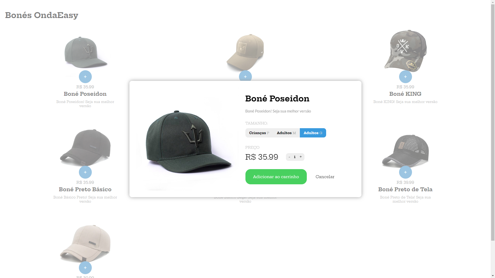

# Venda de Bonés

Esta aplicação foi desenvolvida para testes de habilidades em manipular o DOM. Curso de JavaScript - [B7Web](https://alunos.b7web.com.br/)

## 🚀 Começando

Para ter acesso a aplicação, basta acessar o link: https://bones-ondaeasy.netlify.app/

### 🎥 Usabilidade e funcionalidades

Selecione o item desejado, escolha o tamanho e cor, adicione ao carrinho e depois vá para o chekout. Lá dentro você terá opções para alterar seu pedido, acrescentanto mais itens ou removendo-os.

## 🛠️ Construído com

Todo o projeto foi construído utilizando:

* [HTML5](https://developer.mozilla.org/pt-BR/docs/Web/HTML) - Toda marcação da aplicação.
* [CSS3](https://developer.mozilla.org/pt-BR/docs/Web/CSS) - Toda a estilização da aplicação.
* [JavaScript](https://developer.mozilla.org/pt-BR/docs/Web/JavaScript) - Toda parte de programação/lógica do front-end.
* [Netlify](https://www.netlify.com/) - Utilizado para fazer deploy do front-end.

## 📌 Versão

Todo controle de versão foi realizado dentro do repositório do GitHub.

## ✒️ Autores

* **Marcelo Silva** - *Todo front-end da aplicação* - [/EuMarcel0](https://github.com/EuMarcel0)

## 📄 Licença

Open Source.

## 🎁 Expressões de gratidão

Fico muito grato por ter concluío este projeto! Com fé em Deus deu tudo certo.
💻🚀😊😊
